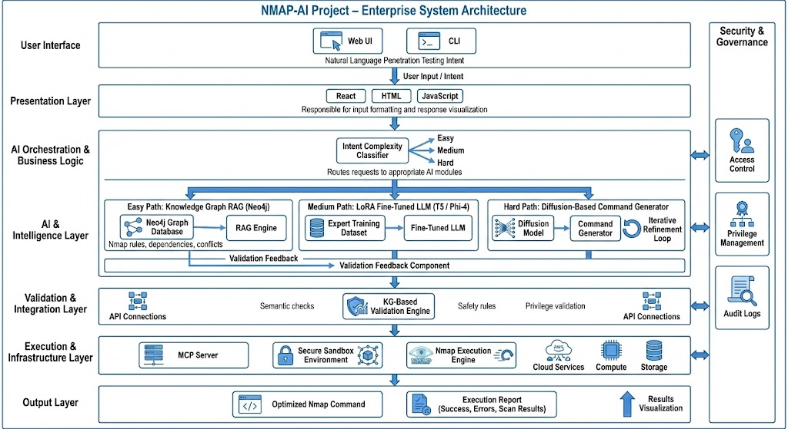
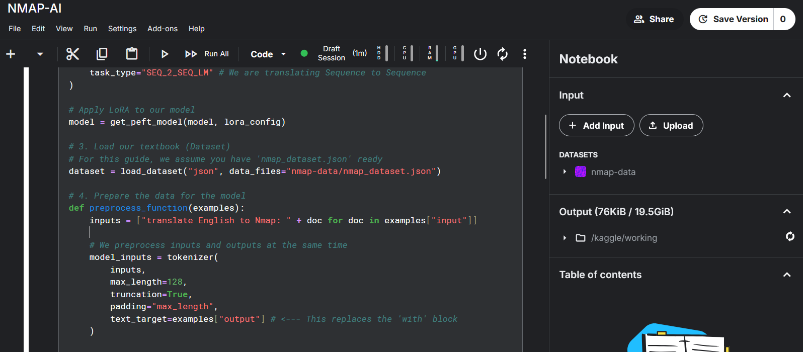
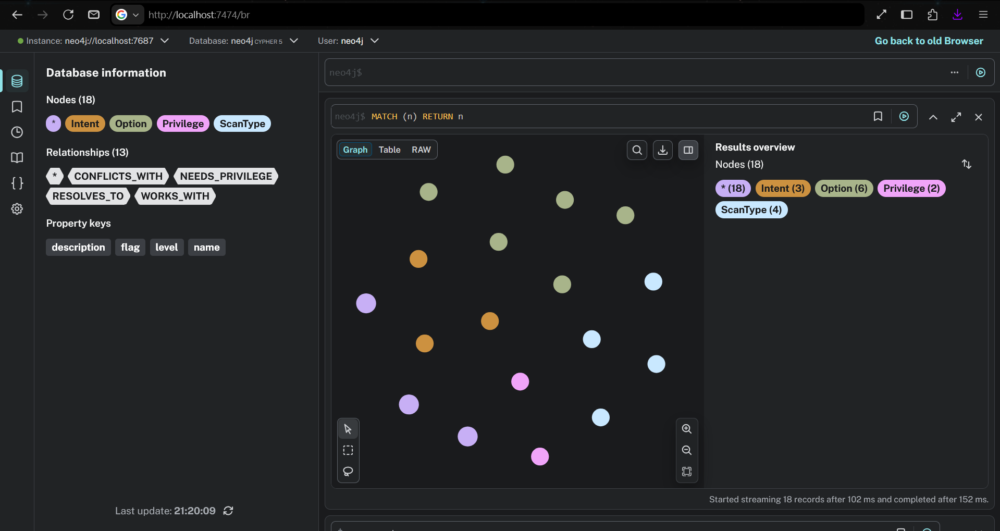
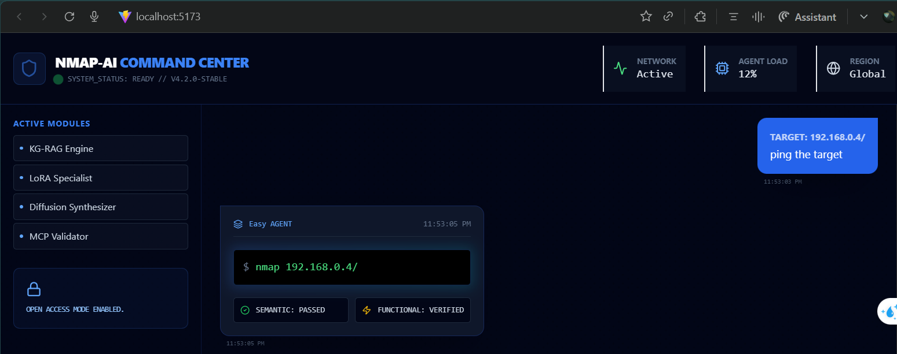
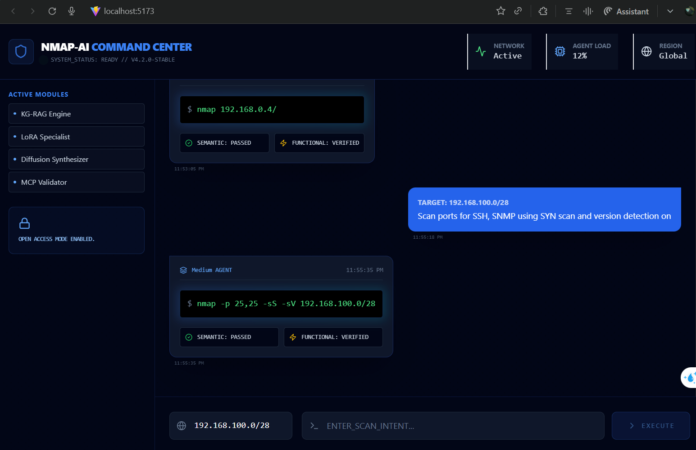
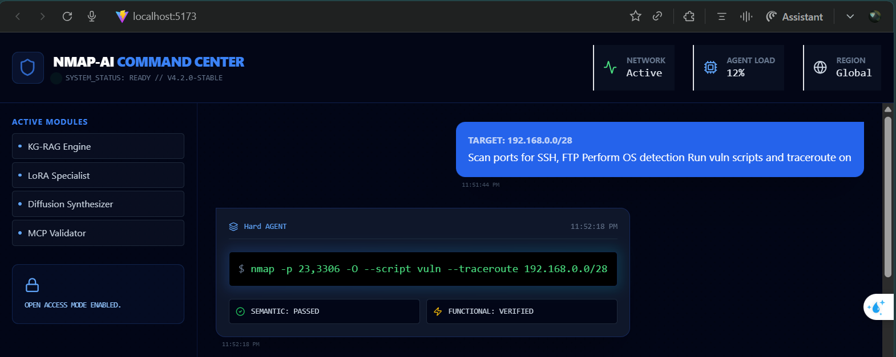
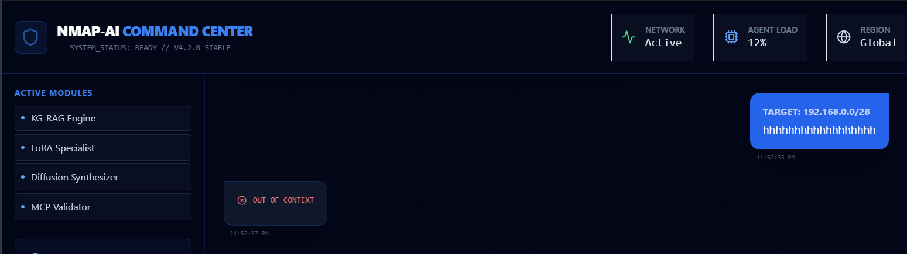

# NMAP-AI: Intelligent Nmap Command Generation & Validation



[](https://opensource.org/licenses/MIT)
[](https://github.com/DL-NMAP-AI/DL-NMAP-AI/actions)
[](https://www.python.org/)
[](https://react.dev/)

**Video Demonstartion:** https://drive.google.com/file/d/1qAeVtsf2Y62EmkX_rvUo5nXjqqCh2P4V/view?usp=sharing

## Short Description

DL-NMAP-AI is an advanced, AI-powered system designed to intelligently generate and validate Nmap commands based on natural language intent. It leverages a multi-agent architecture, combining large language models (LLMs) for intent classification and command refinement, a Knowledge Graph (KG-RAG) for semantic validation, and a LoRA-tuned T5 model for specialized Nmap command synthesis. The system also includes a functional validation component via an MCP server and a modern React-based web interface for intuitive interaction.

## Key Features

*   **Intent Classification:** Utilizes Google Gemini to categorize user requests into \'Irrelevant\', \'Easy\', \'Medium\', or \'Hard\' Nmap scanning intents.
*   **Nmap Command Generation:** Employs a LoRA-tuned T5 model to translate natural language intents into precise Nmap commands.

    
*   **Knowledge Graph (KG-RAG) Validation:** Semantically validates generated Nmap commands against a predefined ontology of Nmap options, privileges, and conflicts, ensuring correctness and adherence to best practices.
*   **Diffusion Synthesis for Complex Intents:** Iteratively refines Nmap commands for \'Hard\' intents using a feedback loop between the LoRA model and KG-RAG validation.
*   **Functional Validation (MCP):** Executes generated Nmap commands in a controlled environment via a Model Context Protocol (MCP) server to verify their real-world functionality.
*   **Interactive Web Interface:** A modern, responsive React frontend provides a chat-like experience for users to interact with the NMAP-AI system.

## Tech Stack

| Category     | Technology                                   | Description                                      |
| :----------- | :------------------------------------------- | :----------------------------------------------- |
| **Backend**  | Python 3.9+                                  | Core language for AI logic and API               |
|              | FastAPI                                      | Web framework for the backend API                |
|              | Transformers (Hugging Face)                  | LoRA-tuned T5 model for command generation       |
|              | PEFT (Parameter-Efficient Fine-Tuning)       | Efficient fine-tuning of LLMs                    |
|              | Google Generative AI (Gemini)                | Intent classification and command refinement     |
|              | `fastmcp`                                    | Model Context Protocol for functional validation |
|              | `python-dotenv`                              | Environment variable management                  |
|              | `uvicorn`                                    | ASGI server for FastAPI                          |
| **Frontend** | React 18+                                    | JavaScript library for building user interfaces  |
|              | Vite                                         | Fast frontend build tool                         |
|              | Tailwind CSS                                 | Utility-first CSS framework                      |
|              | `axios`                                      | Promise-based HTTP client                        |
|              | `lucide-react`                               | Icon library                                     |
| **Database** | Neo4j                                        | Graph database for Knowledge Graph (KG-RAG)      |
| **Tools**    | Nmap                                         | Network scanner (for functional validation)      |

## Prerequisites

Before you begin, ensure you have the following installed:

*   **Python 3.9+**
*   **Node.js (v18+) & npm/yarn**
*   **Git**
*   **Nmap** (installed and accessible in your system\'s PATH, or configure `NMAP_PATH` in `nmap_mcp_server.py`)
*   **Neo4j Database** (running locally or accessible via network)

## Installation & Setup

Follow these steps to get the DL-NMAP-AI project up and running on your local machine.

### 1. Clone the Repository

```bash
git clone https://github.com/DL-NMAP-AI/DL-NMAP-AI.git
cd DL-NMAP-AI
```

### 2. Backend Setup

Create a Python virtual environment and install dependencies:

```bash
python3 -m venv venv
source venv/bin/activate  # On Windows: .\venv\Scripts\activate
pip install -r requirements.txt
```

#### Environment Variables

Create a `.env` file in the root directory of the project and populate it with your credentials and API keys. An example is provided below:

```dotenv
NEO4J_URI=neo4j://localhost:7687
NEO4J_USER=neo4j
NEO4J_PASSWORD=your_neo4j_password
GOOGLE_API_KEY=your_google_gemini_api_key
```

*   **`NEO4J_URI`**: The URI for your Neo4j database.
*   **`NEO4J_USER`**: Your Neo4j username.
*   **`NEO4J_PASSWORD`**: Your Neo4j password.
*   **`GOOGLE_API_KEY`**: Your API key for Google Gemini (Generative AI).

#### 3. Neo4j Knowledge Graph Population
Ensure your Neo4j database is running. Then, execute the `nmap_ontology_population.cypher` script to populate the knowledge graph. You can do this via the Neo4j Browser or `cypher-shell`.

```bash
# Example using cypher-shell (replace with your actual connection details)
cypher-shell -a "bolt://localhost:7687" -u neo4j -p your_neo4j_password < nmap_ontology_population.cypher
```

#### Knowledge Graph Visualization


### 4. Frontend Setup

Navigate to the `nmap-ai-web` directory and install its dependencies:

```bash
cd nmap-ai-web
npm install # or yarn install
```

### 5. Nmap Path Configuration (Optional but Recommended)

If Nmap is not in your system\'s PATH or you are on Windows, you might need to specify its exact location in `nmap_mcp_server.py`. Open `nmap_mcp_server.py` and modify the `NMAP_PATH` variable:

```python
# nmap_mcp_server.py
NMAP_PATH = r\"C:\\Program Files (x86)\\Nmap\\nmap.exe\" # Example for Windows
# Or for Linux/macOS if not in PATH:
# NMAP_PATH = r\"/usr/local/bin/nmap\"
```

## Usage

### 1. Start the Backend API

From the root directory of the project, activate your virtual environment and start the FastAPI application:

```bash
source venv/bin/activate
uvicorn main:app --host 0.0.0.0 --port 8000 --reload
```

The API will be accessible at `http://localhost:8000`.

### 2. Start the MCP Server

In a separate terminal, activate your virtual environment and start the MCP server:

```bash
source venv/bin/activate
python nmap_mcp_server.py
```

### 3. Start the Frontend Web Application

In another separate terminal, navigate to the `nmap-ai-web` directory and start the development server:

```bash
cd nmap-ai-web
npm run dev # or yarn dev
```

The web application will typically open in your browser at `http://localhost:5173` (or another port if 5173 is in use).

### Demonstration: Web App Interaction

The DL-NMAP-AI web interface provides a seamless, chat-like experience for generating and validating Nmap commands. Below are several examples demonstrating the system's capabilities across different intent levels.

#### 1. Simple Intent: Basic Network Connectivity
For straightforward requests like "ping the target", the system identifies the intent as **Easy** and generates a standard Nmap ping scan.

> **Explanation:** The user enters a simple natural language request. The **Easy Agent** quickly translates this into `nmap 192.168.0.4/`, which is then semantically and functionally verified.

#### 2. Medium Intent: Service and Version Detection
When the request involves specific ports and scanning techniques (e.g., "Scan ports for SSH, SNMP using SYN scan and version detection"), the system classifies it as **Medium**.

> **Explanation:** The **Medium Agent** handles more specific requirements, correctly mapping "SSH" and "SNMP" to their respective ports (22, 161) and applying the `-sS` (SYN scan) and `-sV` (Version detection) flags.

#### 3. Complex Intent: Advanced Security Auditing
For highly complex requests involving multiple scripts, OS detection, and network diagnostics, the **Hard Agent** is engaged.

> **Explanation:** This example shows a request for SSH/FTP scanning, OS detection, vulnerability scripts, and traceroute. The system generates a comprehensive command: `nmap -p 22,21 -O --script vuln --traceroute 192.168.0.0/28`. Both semantic and functional validations are passed, ensuring the command is safe and executable.

#### 4. Handling Out-of-Context Requests
The system includes a safety mechanism to filter out irrelevant or malicious natural language inputs that do not pertain to Nmap scanning.

> **Explanation:** When a user enters nonsensical or unrelated text (e.g., "hhhhhhhhhhhhh"), the intent classifier correctly identifies it as **OUT_OF_CONTEXT**, preventing the generation of invalid commands and maintaining system integrity.

## Project Structure

```
DL-NMAP-AI/
├── .env                                # Environment variables for backend configuration
├── kg_rag_engine.py                    # Knowledge Graph RAG engine for semantic validation
├── main.py                             # FastAPI backend application entry point
├── nmap_agent.py                       # (Potentially deprecated/unused, but present)
├── nmap_dataset.json                   # Dataset for training the LoRA model
├── nmap_manager.py                     # Orchestrates intent classification, command generation, and validation
├── nmap_mcp_server.py                  # Model Context Protocol server for functional Nmap command execution
├── nmap_ontology_population.cypher     # Cypher script to populate Neo4j Knowledge Graph
├── requirements.txt                    # Python dependencies for the backend
├── system-architecture.jpg             # System architecture diagram (if available)
├── test_pipeline.py                    # Script for testing the overall pipeline
├── train_nmap_ai.py                    # Script for training the LoRA-tuned T5 model
├── venv/                               # Python virtual environment
├── nmap-ai-final/                      # Directory containing the trained LoRA model adapter
│   ├── adapter_config.json
│   └── adapter_model.safetensors
└── nmap-ai-web/                        # Frontend web application (React + Vite)
    ├── public/
    ├── src/
    │   ├── App.css
    │   ├── App.jsx                     # Main React component for the chat interface
    │   ├── assets/
    │   ├── index.css
    │   └── main.jsx
    ├── index.html
    ├── package.json                    # Frontend dependencies and scripts
    ├── package-lock.json
    ├── postcss.config.js
    ├── tailwind.config.js
    └── vite.config.js
```

## Roadmap / To-Do

*   Implement more sophisticated error handling and user feedback mechanisms.
*   Expand the Nmap Knowledge Graph with more options, rules, and intent mappings.
*   Integrate advanced security features for the MCP server.
*   Explore additional LLM fine-tuning techniques for improved command generation accuracy.
*   Add user authentication and persistent chat history to the web application.

## Contributing

Contributions are welcome! Please feel free to submit a Pull Request. For major changes, please open an issue first to discuss what you would like to change.


## Authors

*   **SOFIANE ZINE-EDDINE**
*   **ALAE-EDDINE ELANDALOUSSI**
*   **NIZAR SENBATI**
*   **OSSAMA ZINE-EDDINE**
*   **SALAH-EDDINE ELHAFIDI**
